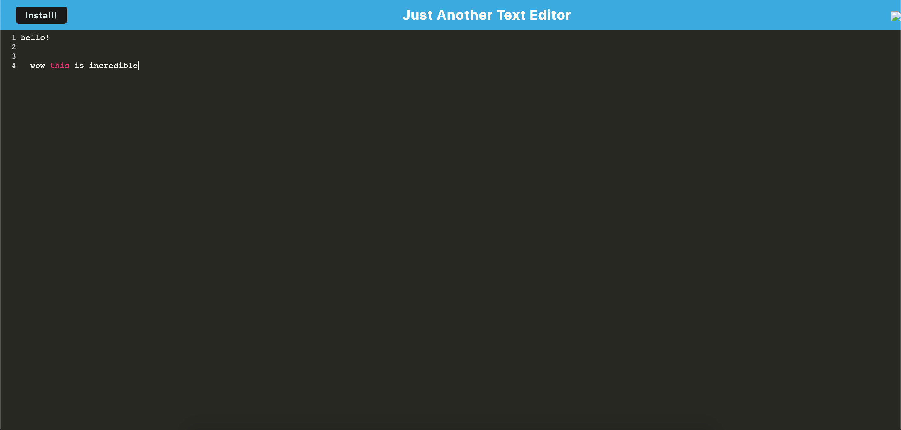

# text-editor-project

This is a full-stack application based on a simple text editor, using both a front end and a database to store data. The application works offline, uses an IndexedDB database and uses a single page format.

I have not managed to reach all of the technical criteria due to time restraints but the core functionality is still available.

The deployed code is accessible here: https://github.com/dylanadams98/text-editor-project

The deployed page is accessible here: https://dylanadams98.github.io/text-editor-project

